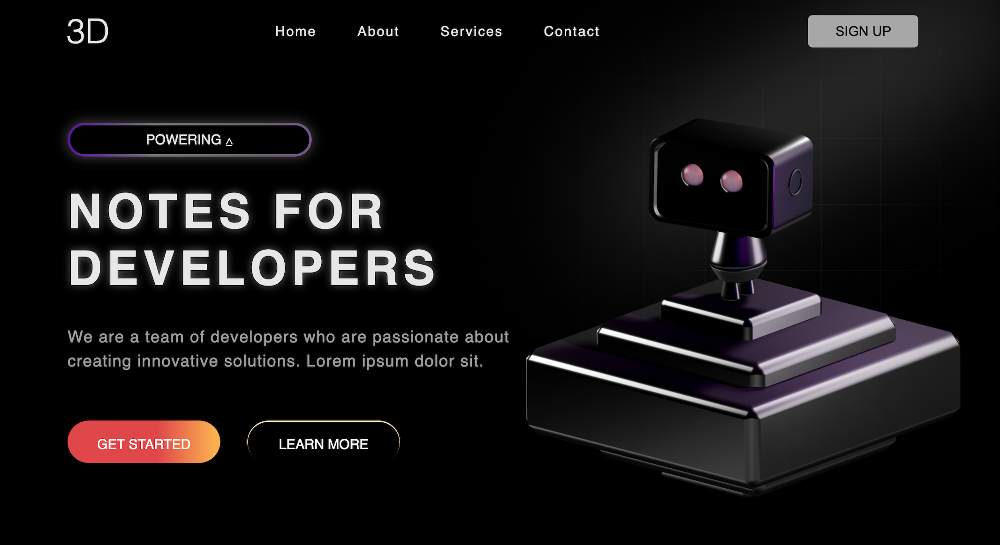

# 3D Landing Page

A visually engaging 3D landing page built with HTML and CSS, featuring a live-embedded 3D robot model and smooth scroll-based animations.

## Features

- **3D Model Integration:** Uses [Spline](https://spline.design/) to embed an interactive 3D scene directly into the page via the `<spline-viewer>` web component.
- **Animated UI:** Smooth entrance and scroll animations powered by [AOS (Animate On Scroll)](https://michalsnik.github.io/aos/).
- **Modern Design:** Responsive layout, animated gradients, and stylish buttons for a modern look.

## Preview

## Technologies & Libraries

- **[Spline Viewer](https://viewer.spline.design/):** Embeds a 3D scene using the `<spline-viewer>` web component and CDN script.
- **[AOS (Animate On Scroll)](https://michalsnik.github.io/aos/):** Adds scroll-triggered animations to elements using `data-aos` attributes.
- **Google Fonts (Poppins):** For modern typography (ensure you have internet access for font loading).

## Credits

- [Spline Viewer](https://viewer.spline.design/) for 3D embedding
- [AOS.js](https://michalsnik.github.io/aos/) for scroll animations
- [Google Fonts](https://fonts.google.com/) for typography
